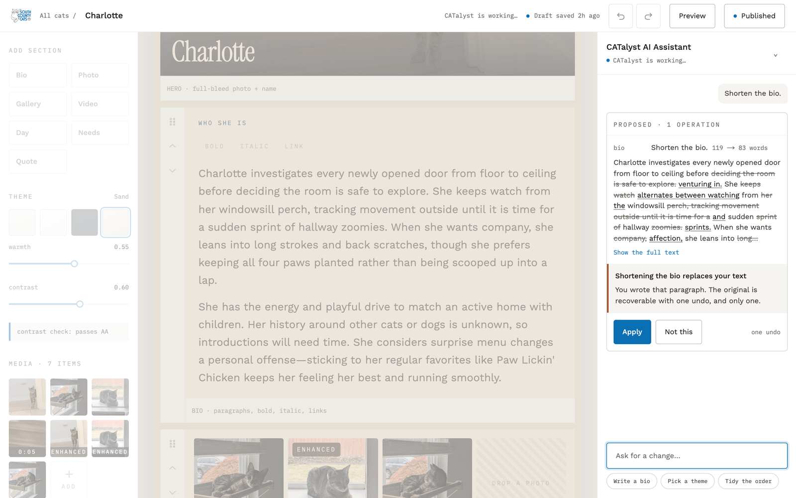
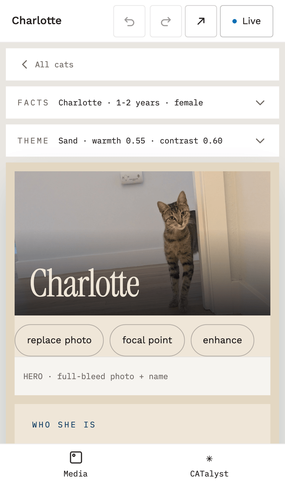
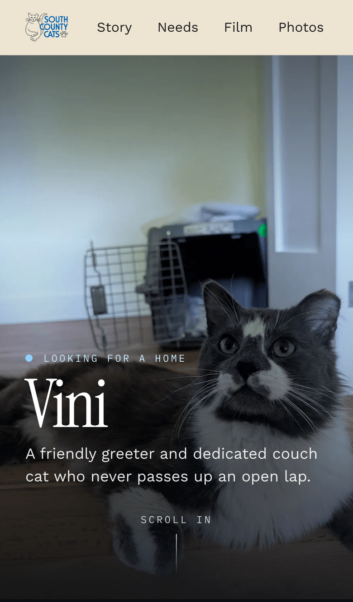
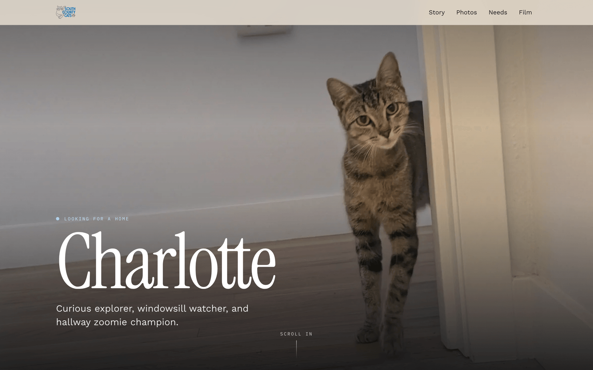
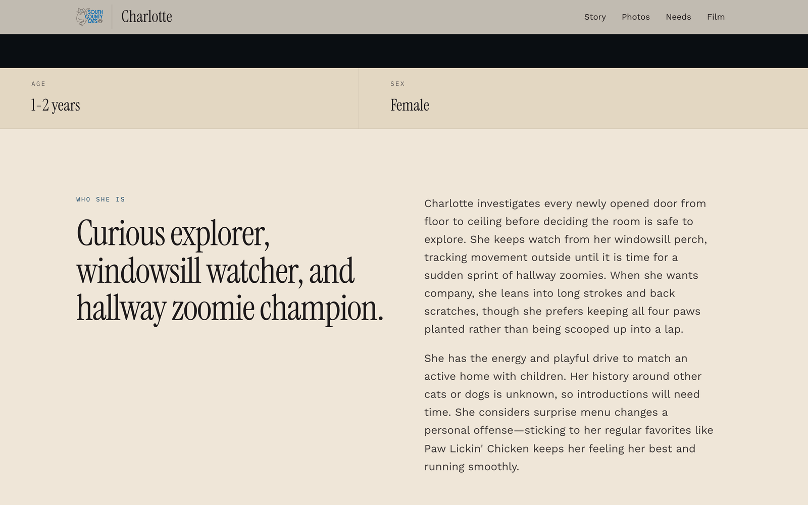
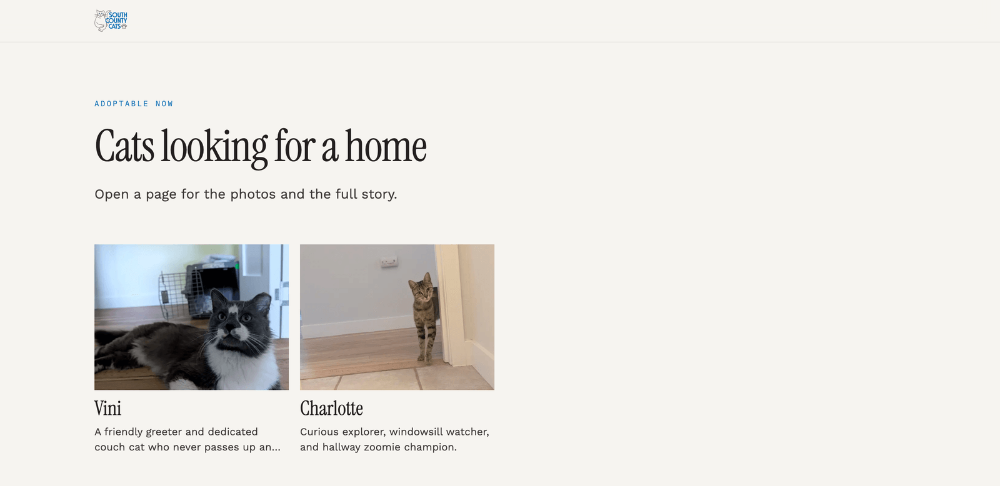
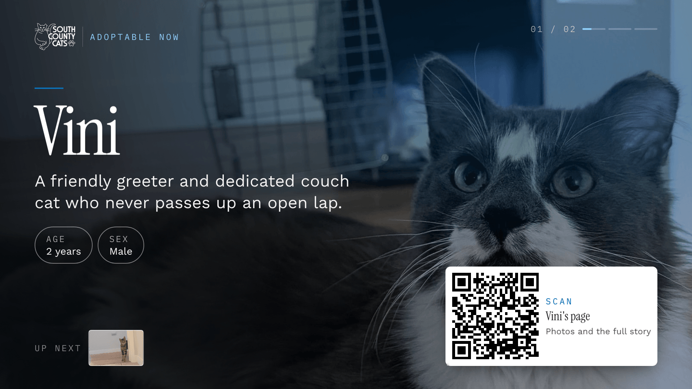

# Cat Profile Builder

A page for every cat in your rescue, built by a volunteer in minutes and good enough to
share anywhere.



You add a cat section by section — a hero photo with the name, the story, a gallery, a short
clip, a day-in-the-life, what the cat needs — drag the sections into the order you want,
pick a colour theme, and publish. The page you get looks like a magazine spread on a laptop
and on a phone.

CATalyst, the helper in the side panel, knows what is on the page. Upload a few photos and
it interviews you — name, rough age, temperament, the story worth telling — and drafts the
whole page from your answers. After that you talk to it: warm up the colours, move the clip
above the gallery, shorten the bio. It applies small, safe changes at once and always shows
you what will be replaced before it touches anything you wrote. Every change it makes is
one undo away.

Photos and clips are handled for you: a long phone video is trimmed to the ten seconds worth
showing, each photo gets a focal point so it crops well at every size, a dim snapshot can be
lifted with one click (and reverted), and every image gets a written description so the page
works with a screen reader. For adoption events, the same profiles play as a full-screen
carousel with a QR code that visitors scan to keep the cat's page.

## What it looks like

| | |
| --- | --- |
|  |  |
| The builder on a phone: facts and theme fold to a line, the drawers hold media and CATalyst. | The published page on a phone. |


The published page. The name and tagline sit over the hero photo; the sections follow.


Further down: the facts strip and the story in two columns.


`/cats` lists every published cat with its photo and one line.


`/kiosk` on an event display: eight seconds per cat, a moving photo or a silent clip, and the
QR card that opens the cat's page.

## How it works

1. A volunteer signs in with the shelter's shared account and opens the builder.
2. They build the page by hand, or upload photos and let CATalyst draft it, then adjust.
3. The draft saves itself as they go. Publish makes it live at `/cats/<name>-<id>`.
4. Visitors read the page; `/cats` lists every published cat.
5. `/carousel` plays every published cat in a loop as a web page; `/kiosk` is the same
   carousel for a TV at an event, unattended, with the QR card.
6. Unpublish takes a page down; the draft stays for next time.

## The technical part

**Stack.** Next.js 16 with React 19 and TypeScript. Tailwind for styling. Zod validates
every document and every boundary. The AI SDK talks to Gemini through Vertex AI; a fake
model with scripted scenarios stands in for it locally and in tests. `sharp` derives every
image size and the photo enhancement; `ffmpeg` trims and transcodes clips. Vitest runs the
unit, component and contract tests; Playwright runs the end-to-end journeys. The framework-
free core under `src/core` has no import from any of these.

### Run it locally

You need Node 22 and pnpm (the version pinned in `package.json`). `ffmpeg` and `ffprobe` on
`PATH` are only needed for video uploads and one adapter test.

```sh
pnpm install --frozen-lockfile
cp .env.example .env.local
```

`.env.example` lists every setting with a local default; `.env.local` is your copy and is
git-ignored. With `STORE=fs MODEL=fake` (the defaults) nothing reaches Google Cloud:
profiles and media are written under `.data/`, and CATalyst answers from the fake model. To
sign in, `SESSION_SECRET` and `SHELTER_PASSWORD_HMAC` must be set; one command produces both
for a password of your choice:

```sh
pnpm make-credentials --env   # prints the two KEY=value lines; paste them into .env.local
```

(Without `--env` the same script writes the deployment's pair for Terraform instead — see
Deploy below.) Then:

```sh
STORE=fs MODEL=fake pnpm dev
```

Open `http://localhost:3000`. To fill the carousel, `pnpm seed --published 20 --archived 2`
writes sample cats into `.data/`. Bring your own photos and clips for hand testing.

### Run the gates

Every one of these must be green before a change is done. They run in
`.github/workflows/ci.yml` on every pull request and push to `main`.

| Gate                                            | Command                       |
| ----------------------------------------------- | ----------------------------- |
| Lint (incl. core import restriction and a11y)   | `pnpm lint`                   |
| Formatting                                      | `pnpm format:check`           |
| Types                                           | `pnpm typecheck`              |
| Unit + component + contract tests with coverage | `pnpm test`                   |
| End-to-end (builds first)                       | `pnpm build && pnpm test:e2e` |
| Production build                                | `pnpm build`                  |

`pnpm test` enforces the coverage thresholds from the constitution; `pnpm test:watch` runs
the same suites without them. `pnpm format` rewrites files to match the formatter.

### Deploy

The app runs on Google Cloud Run. Everything it needs on Google Cloud, including building
and pushing its own container image, is declared in Terraform under `infra/terraform/`;
there is no other deploy path. The full runbook — first apply, the two credential values,
every later deploy, the GitHub Actions setup — is `infra/terraform/README.md`. The short
version, from the repository root:

```sh
pnpm make-credentials
cp infra/terraform/terraform.tfvars.example infra/terraform/terraform.tfvars   # then fill it in
terraform -chdir=infra/terraform init
terraform -chdir=infra/terraform apply
```

`terraform apply` alone builds the image for the checked-out commit, pushes it, and rolls
the service. `terraform.tfvars.example` documents every variable — what it does, its
default, and when you would change it.

One thing to know before the first apply: the published pages and the public bucket are
meant to be readable by anyone. Some organisations enforce a policy
(`iam.allowedPolicyMemberDomains`) that rejects the `allUsers` grant on the bucket. Set
`public_access = false` in your tfvars until an administrator adds a project-level
exception; the stack still applies, and only the bucket stays private. The service itself
is unaffected. Details are in the runbook under "Public access".

### What it needs and what it costs

- A Google Cloud project with billing enabled.
- Cloud Run for the app (2 vCPU, 2 GiB, scales to zero; at most two instances).
- Two Cloud Storage buckets: a private one for originals and drafts, a public one for the
  derived images and clips the pages serve.
- Artifact Registry for the container image.
- Vertex AI for the two Gemini models: one drafts and edits (`gemini-3.8-flash` by
  default), a smaller one describes photos and clips (`gemini-2.5-flash-lite`).

A rough monthly band, assuming a small rescue — a few dozen profiles a month, a few hundred
page views a day, the kiosk running on event days — is low single-digit dollars, most of it
Cloud Run and the model calls; at very light use it can sit inside the free tiers. Storage
is a few gigabytes. The numbers depend on your region and on how much the helper is used,
so check the current price lists before you rely on them. Locally, `MODEL=fake` costs
nothing and needs no Google account.

### Configuration

Environment variables (`.env.example` lists them with local defaults; on Cloud Run,
Terraform sets them from its variables):

| Variable | What it does |
| --- | --- |
| `STORE` | Where profiles and media live: `memory`, `fs` (under `DATA_DIR`) or `gcs` |
| `MODEL` | Which model answers: `fake` or `vertex` |
| `PUBLIC_BASE_URL` | Base of every shareable link and the QR target |
| `SHELTER_USERNAME`, `SHELTER_PASSWORD_HMAC`, `SESSION_SECRET` | The one shared sign-in; the last two come from `pnpm make-credentials` |
| `GCS_PRIVATE_BUCKET`, `GCS_PUBLIC_BUCKET`, `GOOGLE_CLOUD_PROJECT`, `VERTEX_LOCATION` | Google Cloud, read only when `STORE=gcs` or `MODEL=vertex` |
| `MODEL_DRAFTING`, `MODEL_DESCRIBER` | The two Gemini model ids |
| `LOG_LEVEL` | Server log level |

Terraform variables (`infra/terraform/terraform.tfvars.example` explains each): `project_id`
and `shelter_username` are required; `region`, `vertex_location`, `service_name`,
`public_base_url`, `private_bucket_name`, `public_bucket_name`, `model_drafting`,
`model_describer`, `public_access`, `image`, `image_tag` and `signer_developers` have
defaults. `session_secret` and `shelter_password_hmac` are written by
`pnpm make-credentials` to `infra/terraform/secrets.auto.tfvars` and never typed by hand.

### Before you publish a fork

These stay on your machine and must never be committed: `infra/terraform/terraform.tfvars`,
`infra/terraform/secrets.auto.tfvars`, `infra/terraform/backend.hcl`, any Terraform state
file (`*.tfstate*`), `.env.local`, `test-media/`, and the `.data*` directories (the local
profile and media store). All of them are git-ignored already; check before you push a
history that started elsewhere.

### Project layout

| Path | What lives there |
| --- | --- |
| `src/core` | The domain: profile document, edit operations, media rules, carousel roster, auth. Plain TypeScript, no framework imports (the lint gate enforces it) |
| `src/adapters` | Everything that touches the outside world: stores (`memory`, `fs`, `gcs`), the language model (`fake`, `vertex`), `sharp`, `ffmpeg`, config, logging |
| `src/app` | Next.js routes: the builder, the public pages, the carousel and kiosk, the API |
| `src/ui` | React components: builder, helper panel, profile page, carousel, shared pieces |
| `tests` | Unit, component, contract and end-to-end suites, with the fakes and fixtures they share |
| `specs` | The feature specification, plan and tasks — the record of what was decided and why |
| `references` | Design system, content strings, and the architecture decision records (`references/project/adr`) |
| `infra/terraform` | The deployment, declared once |
| `scripts` | `make-credentials`, `seed`, and the small checks the gates run |

### Contributing

Issues and pull requests are welcome. Before opening a PR:

- Read `.specify/memory/constitution.md`. It is binding for all code: framework-free core,
  test-first, coverage thresholds, strict typing, guarded AI editing.
- Work spec-first. A change in behaviour starts with the specification under `specs/`, not
  with code. Small fixes can go straight to a PR with a test.
- Run the gates above and make sure every one is green.

### License

MIT — see `LICENSE`.
